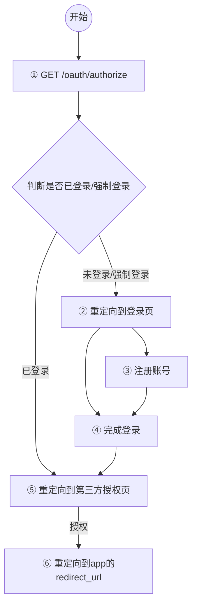

# 登录流程

```mermaid

graph TB
   A((开始))
   B[① GET /oauth/authorize]
   C{判断是否已登录/强制登录}
   D[⑥ 重定向到app的redirect_url]
   E[② 重定向到登录页]
   F[④ 完成登录]
   G[⑤ 重定向到第三方授权页]
   H[③ 注册账号]

    A --> B
    B --> C
    C -->|已登录| G
    C -->|未登录/强制登录| E
    E --> F
    F --> G
    G -->|授权| D
    E --> H
    H --> F

```
